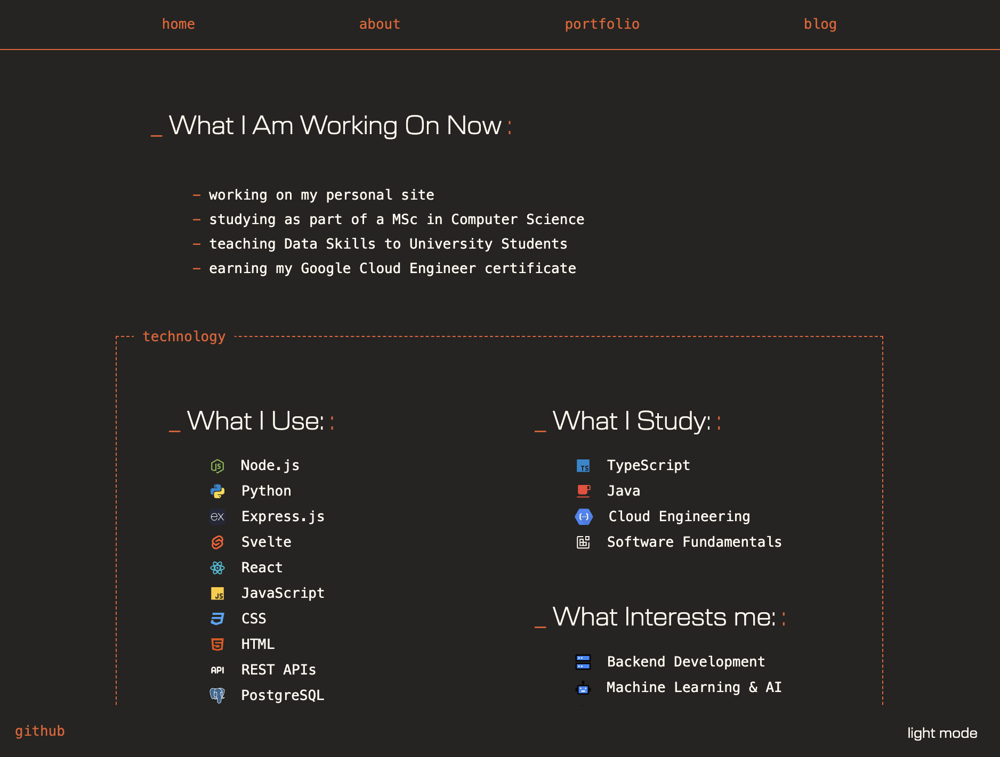
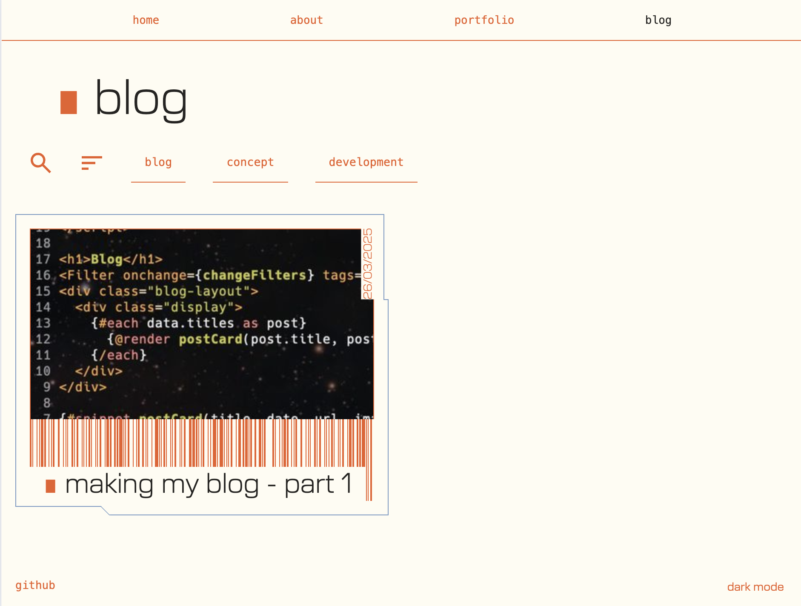
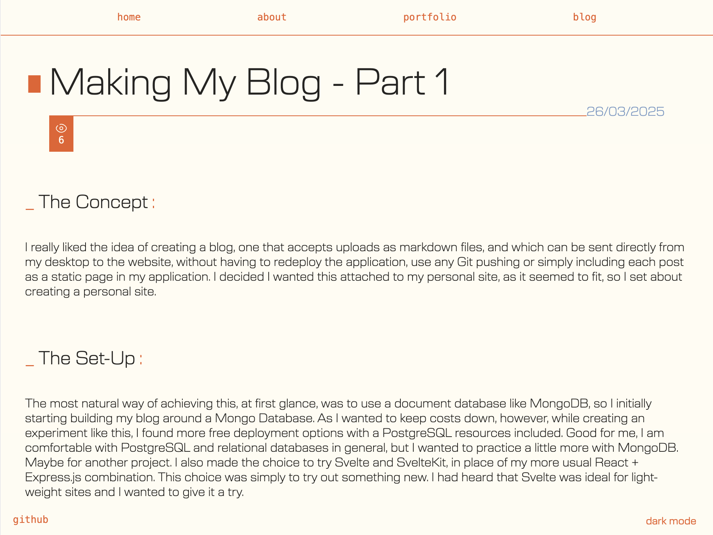

# Personal Homepage

[Visit my site!](https://renewed-hedwiga-niallantony-85e6d38f.koyeb.app)

A personal homepage to showcase myself as a developer. 
Created with SvelteKit and node.js (back-end for handling blog posts)

## About

Information about me as a developer

## Portfolio

Key projects to showcase

## Blog

Personal blog and learning journal

Uploading of blog posts is done through an upload API in the same SvelteKit application, and a local application which encrypts, compresses and sends information.> 
Thumbnails and images are stored in cloud file storage and retrieved dynamically - although more optimisation is needed. 
Blog contents are kept in a PostgreSQL database, and tags are collected in a relational database to retrieve the most popular tags to display.
Currently posts are only searchable through tags, but in the future I plan to implement full text searching as well as smart extraction of key words from posts.

The blog is used as a developer diary to document my ongoing learning in any and all development related fields.

Please feel free to reach out!
